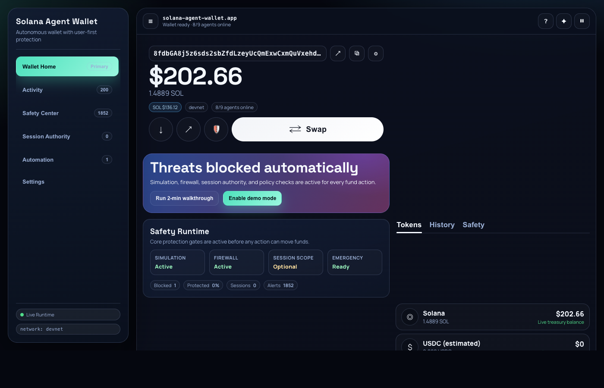

# Solana Agent Wallet

A production-grade agentic wallet for Solana — built to the same standard as Coinbase AgentKit, awal, and Privy server wallets, but native to Solana.

**Agents can: Send · Receive · Swap · Lend · Stake · Monitor**



---

## Architecture

```
LLM (Claude / GPT / any MCP client)
  ↓ MCP tool calls
┌─────────────────────────────────────┐
│         Wallet MCP Server           │
│  ┌──────────────────────────────┐   │
│  │       Skill Registry         │   │
│  │  transfer_sol   get_balance  │   │
│  │  jupiter_swap   get_quote    │   │
│  │  marginfi_*     marinade_*   │   │
│  └──────────┬───────────────────┘   │
│  ┌──────────▼───────────────────┐   │
│  │       Policy Engine          │   │
│  │  reserve · per-tx · daily    │   │
│  │  cooldown · program-allowlist│   │
│  │  destination · human-gate   │   │
│  └──────────┬───────────────────┘   │
│  ┌──────────▼───────────────────┐   │
│  │      Signing Layer           │   │
│  │  Keypair (dev) │ Turnkey     │   │
│  │  Privy (prod)  │ Lit Protocol│   │
│  └──────────┬───────────────────┘   │
└────────────┼────────────────────────┘
             ↓ Solana RPC (Helius)
  Jupiter · Marginfi · Marinade · SPL
```

---

## Prerequisites

- **Node.js >= 20** (`node --version` to check)
- A Solana devnet wallet or use the built-in encrypted wallet generator

## Quick Start

```bash
git clone https://github.com/Clintobi/agentic-wallet-v1.git
cd agentic-wallet-v1
npm install
cp .env.example .env
# Edit .env: set WALLET_PASSPHRASE

# Start dashboard
npm run dashboard
# Open http://localhost:3000

# Or: MCP server (for Claude Desktop)
npm run mcp
```

---

## Skills

29 registered skills across 9 categories. All fund-moving skills are policy-gated and pre-flight simulated before broadcast.

**Wallet**

| Skill | Description |
|---|---|
| `get_balance` | SOL balance of treasury wallet |
| `get_portfolio` | All token balances (SOL + SPL) |
| `get_portfolio_pnl` | Portfolio P&L vs first snapshot |

**Transfers**

| Skill | Description |
|---|---|
| `transfer_sol` | Send SOL — pre-flight simulated, policy-gated |
| `transfer_usdc` | Send USDC — auto-creates destination ATA |

**Swaps (Jupiter)**

| Skill | Description |
|---|---|
| `jupiter_swap` | Swap any token pair via best route |
| `get_quote` | Preview swap output without executing |
| `get_sol_price` | Live SOL/USD price |

**Lending (MarginFi)**

| Skill | Description |
|---|---|
| `marginfi_get_rates` | Deposit/borrow APY for SOL/USDC |
| `marginfi_deposit` | Deposit collateral |
| `marginfi_borrow` | Borrow against collateral |

**Staking (Marinade)**

| Skill | Description |
|---|---|
| `get_stake_rate` | Current Marinade staking APY |
| `marinade_stake` | Liquid-stake SOL → mSOL |
| `marinade_unstake` | Unstake mSOL → SOL |

**Guardian (Security Monitoring)**

| Skill | Description |
|---|---|
| `guardian_check` | Price spike/crash detection, TX velocity alerts, balance threshold monitoring |
| `get_alerts` | Retrieve security alerts (filterable by severity) |
| `ack_alerts` | Acknowledge alerts |

**Accountant (Balance Tracking)**

| Skill | Description |
|---|---|
| `balance_snapshot` | Record timestamped balance snapshot |
| `get_snapshots` | Retrieve historical snapshot series |
| `get_yield_summary` | Compute yield earned since first snapshot |

**Autopilot (IF/THEN Rules)**

| Skill | Description |
|---|---|
| `autopilot_create_rule` | Create IF/THEN rule (e.g. "Stake 0.1 SOL if price < $150") |
| `autopilot_list_rules` | List all active rules |
| `autopilot_toggle_rule` | Enable/disable a rule |
| `autopilot_delete_rule` | Remove a rule |
| `rule_evaluation` | Evaluate all active rules against current market |

**Payments (Solana Pay)**

| Skill | Description |
|---|---|
| `create_payment_request` | Generate a Solana Pay URL + QR code |
| `list_payment_requests` | List all open/completed requests |
| `cancel_payment_request` | Cancel a pending request |
| `check_payment_status` | Check on-chain settlement status |

For the complete protocol-style spec (input schemas, access levels, policy triggers, example calls), see [`SKILLS.md`](./SKILLS.md).

For a security-focused architecture write-up, see [`docs/DEEP_DIVE.md`](./docs/DEEP_DIVE.md).

For Day 3 judging alignment (targets, live demo flow, and code evidence mapping), see [`docs/DAY3_RUBRIC_MAP.md`](./docs/DAY3_RUBRIC_MAP.md).

---

## Policy Engine

All actions pass through **11 checks** before signing. First failure blocks execution immediately.

| # | Check | Description |
|---|---|---|
| 0 | **Emergency pause** | Global kill switch — halts ALL agents instantly |
| 1 | **Agent frozen** | Per-agent freeze (manual or auto-triggered by velocity guard) |
| 2 | **Agent scope** | Agent may only call skills in its allowlisted set |
| 3 | **Reserve floor** | Wallet keeps ≥ `reserveSol` after the action |
| 4 | **Per-tx limit** | Single action ≤ `maxPerTxSol` |
| 5 | **Daily rolling limit** | 24h spend total ≤ `dailyLimitSol` per agent |
| 5a | **Velocity auto-freeze** | Agent frozen if 1-min spend exceeds `velocityFreezeSol` |
| 6 | **Program allowlist** | Called programs must be in `allowedPrograms` (empty = allow all) |
| 7 | **Destination allowlist** | Recipients must be in `allowedDestinations` (empty = allow all) |
| 8 | **Cooldown** | Min seconds between actions per agent |
| 9 | **Human approval gate** | Actions ≥ `approvalThresholdSol` require explicit sign-off |

All values live in `policy.json` and are **hot-reloadable** — change them via the dashboard or `POST /api/policy` without restarting.

---

## MCP Server (Claude Desktop)

Add to `~/Library/Application Support/Claude/claude_desktop_config.json`:

```json
{
  "mcpServers": {
    "solana-wallet": {
      "command": "node",
      "args": ["/path/to/solana-agent-wallet/mcp/server.js"],
      "env": {
        "WALLET_PASSPHRASE": "your-passphrase",
        "SOLANA_NETWORK": "devnet"
      }
    }
  }
}
```

Then in Claude: *"What's my SOL balance?"* or *"Swap 0.1 SOL to USDC"*

---

## Adding New Skills

```js
// src/skills/myprotocol.js
import { z } from "zod";
import { register } from "./registry.js";

register({
  name:        "my_action",
  description: "Does something useful on Solana",
  inputSchema: z.object({
    amountSol: z.number().describe("Amount in SOL"),
  }),
  async handler({ amountSol }, { signer, agentId }) {
    // ... build tx, sign, send
    return { sig, amountSol };
  },
});
```

Import it in `src/agent.js`, `mcp/server.js`, and `dashboard/server.js`. Done.

---

## Upgrading the Signing Layer

The signing layer is swappable. To use Turnkey in production:

```js
// src/signing/turnkeySigner.js
import { Turnkey } from "@turnkey/sdk-server";
import { TurnkeySigner } from "@turnkey/solana";

export function createTurnkeySigner(walletAddress) {
  const client = new Turnkey({ ... });
  return {
    publicKey: new PublicKey(walletAddress),
    async signTransaction(tx) { /* use TurnkeySigner */ },
    async signMessage(msg)    { /* use TurnkeySigner */ },
  };
}
```

Pass to `runAgents({ signer: createTurnkeySigner(...) })`. Everything else stays the same.

---

## Contest: Superteam Nigeria DeFi Developer Challenge
Built for the $5,000 USDG prize pool. Industry-standard architecture inspired by:
- **awal** (Coinbase) — skill module pattern, human-controlled spend limits
- **CDP AgentKit** — action provider plugin system, human-in-the-loop hooks
- **Privy server wallets** — delegation model, swappable signing layer
- **Solana Agent Kit** — Solana-native DeFi integrations
