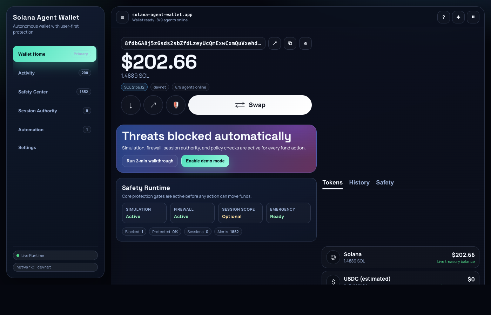

# Solana Agent Wallet

**Safe autonomous Solana wallet runtime.**

Nine independent agents — each with its own encrypted keypair, role, and policy scope — execute real on-chain actions on Solana devnet with full Safety Runtime control: pause, freeze, firewall, simulation gate, and signed receipts.

**Agents can: Send · Receive · Swap · Lend · Stake · Monitor**



---

## For Judges — Start Here

```bash
git clone https://github.com/Clintobi/agentic-wallet-v1.git
cd agentic-wallet-v1
npm install
cp .env.example .env
# Edit .env — set WALLET_PASSPHRASE to any string

WALLET_PASSPHRASE=contest2025 npm start
# Open http://localhost:3000
```

> **One command. One URL. No external accounts or API keys needed for devnet.**

See **[docs/JUDGING_GUIDE.md](./docs/JUDGING_GUIDE.md)** for the 6-minute live demo walkthrough and exact rubric evidence pointers.

---

## Architecture

```
Owner / Operator
  ↓ Dashboard (http://localhost:3000)  │  Claude / GPT
  ↓ REST + SSE                         │  ↓ MCP tool calls
┌──────────────────────────────────────────────────────┐
│                 Solana Agent Wallet                  │
│  ┌─────────────────────────────────────────────────┐ │
│  │             Safety Runtime                      │ │
│  │  emergencyPause · perAgentFreeze · firewall     │ │
│  │  velocityAutoFreeze · preflight simulation      │ │
│  │  signedReceipts · sessionScopes · idempotency   │ │
│  └──────────────────┬──────────────────────────────┘ │
│  ┌──────────────────▼──────────────────────────────┐ │
│  │         11-Check Policy Engine                  │ │
│  │  0: emergency pause    6: program allowlist     │ │
│  │  1: agent frozen       7: destination allowlist │ │
│  │  2: agent scope        8: cooldown              │ │
│  │  3: reserve floor      9: human approval gate   │ │
│  │  4: per-tx limit      5a: velocity auto-freeze  │ │
│  │  5: daily limit                                 │ │
│  └──────────────────┬──────────────────────────────┘ │
│  ┌──────────────────▼──────────────────────────────┐ │
│  │           Skill Registry (29 skills)            │ │
│  │  transfer_sol   jupiter_swap   marginfi_*       │ │
│  │  marinade_*     guardian       autopilot        │ │
│  │  proof_of_execution  get_balance  +18 more      │ │
│  └──────────────────┬──────────────────────────────┘ │
│  ┌──────────────────▼──────────────────────────────┐ │
│  │      Per-Agent Signing Layer (9 wallets)        │ │
│  │  AES-256-GCM encrypted keypair per agent        │ │
│  │  Swappable → Turnkey / Privy / Lit for prod     │ │
│  └──────────────────┬──────────────────────────────┘ │
└─────────────────────┼────────────────────────────────┘
                      ↓ Solana RPC (devnet / Helius mainnet)
         Jupiter · MarginFi · Marinade · SPL Memo
```

---

## Quick Start

### Prerequisites

- **Node.js >= 20** (`node --version` to check)
- No external accounts or API keys needed for devnet

### Install & Run

```bash
git clone https://github.com/Clintobi/agentic-wallet-v1.git
cd agentic-wallet-v1
npm install

# Optional: run setup checker
node scripts/setup.js

# Configure
cp .env.example .env
# Edit .env — set WALLET_PASSPHRASE to any string

# Start dashboard (primary UI)
WALLET_PASSPHRASE=your-phrase npm start
# → http://localhost:3000

# Or: MCP server for Claude Desktop
WALLET_PASSPHRASE=your-phrase npm run mcp
```

### Test Suite

```bash
WALLET_PASSPHRASE=test npm test
# 109 tests, 0 failures
# Covers: policy engine, skill registry, wallet helpers,
#         session validation, firewall scoring, idempotency, retry logic
```

---

## Safety Runtime

The Safety Runtime is the hero feature. Every agent action passes through **11 ordered checks** before signing. First failure blocks immediately.

| # | Check | Config key |
|---|---|---|
| 0 | **Emergency pause** — global kill switch | `emergencyPause` |
| 1 | **Agent frozen** — per-agent manual or auto-freeze | `frozenAgents[]` |
| 2 | **Agent scope** — skill allowlist per agent | `agentScopes{}` |
| 3 | **Reserve floor** — wallet keeps ≥ N SOL always | `reserveSol` |
| 4 | **Per-tx limit** — single action ceiling | `maxPerTxSol` |
| 5 | **Daily rolling limit** — 24h spend cap per agent | `dailyLimitSol` |
| 5a | **Velocity auto-freeze** — 1-min spike protection | `velocityFreezeSol` |
| 6 | **Program allowlist** — only approved programs | `allowedPrograms[]` |
| 7 | **Destination allowlist** — only approved recipients | `allowedDestinations[]` |
| 8 | **Cooldown** — min seconds between actions | `cooldownSeconds` |
| 9 | **Human approval gate** — large tx requires sign-off | `approvalThresholdSol` |

All values live in `policy.json` — **hot-reloadable** without restart.

**Beyond the policy engine:**
- Transaction firewall with risk scoring (0–100) and structured block reasons
- Pre-flight simulation before every fund-moving action
- Idempotency keys — 24h replay-attack prevention for value-moving skills
- Scoped sessions — TTL, skill allowlist, amount cap, destination allowlist, Ed25519 binding proof
- Key rotation with full audit log
- Signed receipts: `GET /api/txs/:txId/receipt` (JSON) · `receipt.html` (shareable)

---

## Skills

29 registered skills across 9 categories. All fund-moving skills are policy-gated and pre-flight simulated.

| Category | Skills |
|---|---|
| **Wallet** | `get_balance`, `get_portfolio`, `get_portfolio_pnl` |
| **Transfers** | `transfer_sol` ⬡, `transfer_usdc` ⬡ |
| **Swaps** | `jupiter_swap` ⬡, `get_quote`, `get_sol_price` |
| **Lending** | `marginfi_get_rates`, `marginfi_deposit` ◎, `marginfi_borrow` ◎ |
| **Staking** | `get_stake_rate`, `marinade_stake` ◎, `marinade_unstake` |
| **Security** | `guardian_check`, `get_alerts`, `ack_alerts` |
| **Analytics** | `balance_snapshot`, `get_snapshots`, `get_yield_summary` |
| **Autopilot** | `autopilot_create_rule`, `autopilot_list_rules`, `autopilot_toggle_rule`, `autopilot_delete_rule`, `rule_evaluation` |
| **Payments** | `create_payment_request`, `list_payment_requests`, `cancel_payment_request`, `check_payment_status` |
| **Onchain proof** | `proof_of_execution` ⬡ (SPL Memo — real devnet sig) |

⬡ = real on-chain transaction with signature · ◎ = intent recorded (devnet sim; real on mainnet)

For full input/output schemas, risk classes, policy triggers, and example calls: → **[SKILLS.md](./SKILLS.md)**

For security architecture, threat model, custody model: → **[docs/DEEP_DIVE.md](./docs/DEEP_DIVE.md)**

For the live demo and judging rubric: → **[docs/JUDGING_GUIDE.md](./docs/JUDGING_GUIDE.md)**

For execution path truth (what's real vs simulated): → **[docs/TRUTH_MATRIX.md](./docs/TRUTH_MATRIX.md)**

---

## Multi-Agent Runtime

Nine independent agents run autonomously on their own intervals:

| Agent | Role | Interval |
|---|---|---|
| `sable` | Bear trader | 30s |
| `nova` | Bull trader | 30s |
| `axiom` | LP sentinel | 60s |
| `crest` | Yield farmer | 120s |
| `pilot` | Autopilot | 60s |
| `harvest` | Airdrop farmer | 45s |
| `ledger` | Accountant | 120s |
| `shield` | Guardian | 20s |
| `pay` | Social wallet | 300s |

Each agent has its own AES-256-GCM encrypted keypair, policy scope, spend tracking, and key rotation history.

---

## MCP Server (Claude Desktop)

Add to `~/Library/Application Support/Claude/claude_desktop_config.json`:

```json
{
  "mcpServers": {
    "solana-wallet": {
      "command": "node",
      "args": ["/absolute/path/to/solana-agent-wallet/mcp/server.js"],
      "env": {
        "WALLET_PASSPHRASE": "your-passphrase",
        "SOLANA_NETWORK": "devnet"
      }
    }
  }
}
```

Then in Claude: *"What's my SOL balance?"* · *"Send 0.05 SOL to..."* · *"What's the Marinade staking APY?"*

---

## Adding New Skills

```js
// src/skills/myprotocol.js
import { z } from "zod";
import { register } from "./registry.js";

register({
  name:        "my_action",
  description: "Does something useful on Solana",
  inputSchema: z.object({
    amountSol: z.number().describe("Amount in SOL"),
  }),
  async handler({ amountSol }, { signer, agentId }) {
    return { sig, amountSol };
  },
});
```

Import in `dashboard/server.js`. Policy, idempotency, and receipts apply automatically.

---

## Upgrading the Signing Layer

```js
// src/signing/turnkeySigner.js
export function createTurnkeySigner(walletAddress) {
  return {
    publicKey: new PublicKey(walletAddress),
    async signTransaction(tx) { /* Turnkey API */ },
    async signMessage(msg)    { /* Turnkey API */ },
  };
}
```

Pass `signer: createTurnkeySigner(...)` to `HeartbeatEngine`. Everything else — policy, registry, receipts — is unchanged.

---

## Contest

Built for the [Superteam Nigeria DeFi Developer Challenge](https://earn.superteam.fun) — $5,000 USDG prize pool.

Architecture inspired by Coinbase AgentKit (awal), CDP AgentKit, Privy server wallets, and Solana Agent Kit — built native to Solana with a production-grade safety runtime as the primary differentiator.
