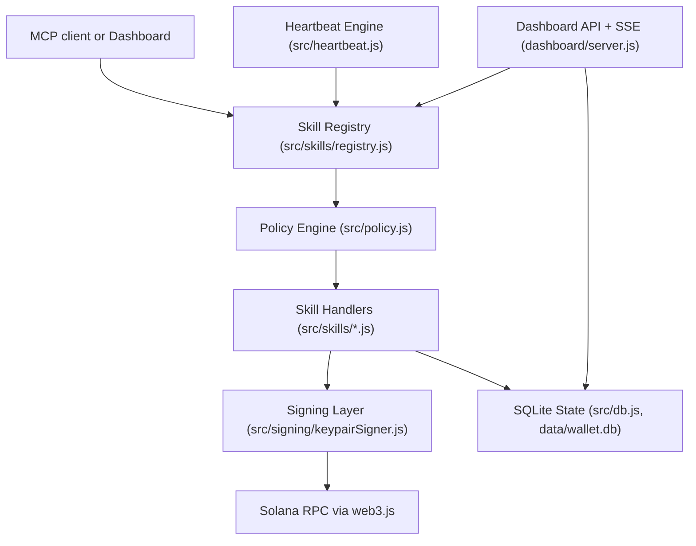

# Deep Dive: Safe Autonomous Finance on Solana

## Thesis
Solana Agent Wallet is designed to solve the safety paradox in agentic wallets: letting agents execute autonomously while preserving strong owner control.

The core claim is practical, not theoretical:
- Autonomous execution is useful only if failure and abuse are containable.
- Containment requires runtime controls, not only key custody.

## Problem Framing
Agentic wallets face three conflicting requirements:
1. Agent autonomy: execute without per-transaction human clicks.
2. Owner control: instantly stop or constrain behavior when needed.
3. Non-custodial operation: private keys remain under owner-controlled signing infrastructure.

The implementation in this repo addresses this with a policy-gated execution pipeline and explicit emergency controls.

## Architecture

## Component Responsibilities
- `src/skills/registry.js`
  - Single execution gateway.
  - Validates schema (Zod), applies policy, dispatches handlers.
- `src/policy.js`
  - Ordered safety checks: pause, freeze, scope, reserve, limits, allowlists, cooldown, human gate.
  - Velocity-based auto-freeze support (`velocityFreezeSol`).
- `src/heartbeat.js`
  - Runs 9 named agents on role-based intervals.
  - Broadcasts runtime events via SSE.
- `dashboard/server.js`
  - Operator control plane: state, rules, policy, pause/resume, freeze/unfreeze.
  - Receipt endpoints for auditability.
- `src/db.js`
  - Durable execution trail for agents, transactions, events, rules, snapshots, alerts, payment requests.

## Security Controls Implemented

### 1. Emergency Kill Switch
- Global stop via `POST /api/pause`.
- Resume via `POST /api/resume`.
- Policy engine blocks execution while `emergencyPause = true`.

### 2. Pre-Flight Transaction Simulation
Before broadcast, simulation checks are implemented for real fund-moving paths:
- `transfer_sol` (`simulateTransferSol`)
- `transfer_usdc` (`simulateTx` in transfer path)
- `jupiter_swap` (`connection.simulateTransaction` before send)

If simulation fails, execution returns an error and no transaction is sent.

### 3. Spending Velocity Auto-Freeze
- Policy enforces rolling 1-minute spend threshold (`velocityFreezeSol`).
- Breaching threshold auto-freezes offending agent (`frozenAgents`).
- Unfreeze requires explicit operator action.

### 4. Transaction Receipts
- JSON receipt: `GET /api/txs/:txId/receipt`
- Shareable HTML receipt: `GET /api/txs/:txId/receipt.html`
- Receipt data includes status, skill, amount, addresses, reason/error, signature, explorer URL, and timestamps.

## Threat Model

### Key Risks
- Prompt-driven unsafe actions.
- Runaway loops draining treasury.
- Repeated failing transactions causing stale-state decisions.
- Unapproved destination/program use.
- High-frequency automated spend spikes.

### Mitigations in Repo
- Scope allowlist gating before execution for all skill calls.
- Spend/limit policy gating for amount-bearing actions.
- Per-action and rolling spend limits.
- Cooldown and human-approval threshold.
- Emergency global pause and per-agent freeze.
- Pre-flight simulation for major send/swap routes.
- Persistent event/tx logging for forensic review.

## How AI Agents Interact With the Wallet

### MCP Path
1. AI client calls an MCP tool in `mcp/server.js`.
2. MCP tool maps to a registered skill.
3. Skill executes through registry policy gate.
4. Result is returned as structured JSON/text.

### Autonomous Path
1. Heartbeat tick triggers role logic (`src/heartbeat.js`).
2. Role invokes skill(s) via registry.
3. Policy decides allow/block.
4. Result is persisted and streamed to dashboard.

## Scalability and Operations
- Multiple agents run independently with separate heartbeat timers.
- SQLite in WAL mode supports concurrent reads from dashboard while agents write.
- Skill registry pattern allows incremental protocol expansion without rewriting execution core.

## Design Tradeoffs
- Some protocol integrations (Marginfi/Marinade intent flows) are currently simulated on devnet for reliability and demo safety.
- This increases demonstration breadth but should be tightened with additional live transaction flows for production hardening.

## Recommended Submission Narrative
Use one message throughout demo and docs:

"This wallet is autonomous by default, but policy-governed and operator-controllable under stress."

Suggested live demo sequence:
1. Trigger normal autonomous activity.
2. Show policy block on a limit breach.
3. Show a simulation-failed action prevented before send.
4. Hit emergency pause and prove all actions halt.
5. Show auto-freeze behavior and manual unfreeze.
6. Open receipt page for a recent transaction.

## Evidence Pointers (Repo)
- Skill gateway: `src/skills/registry.js`
- Safety policy: `src/policy.js`
- Heartbeat runtime: `src/heartbeat.js`
- Dashboard controls: `dashboard/server.js`
- Transactions and receipts: `src/db.js`, `dashboard/server.js`
- Skill implementations: `src/skills/*.js`
