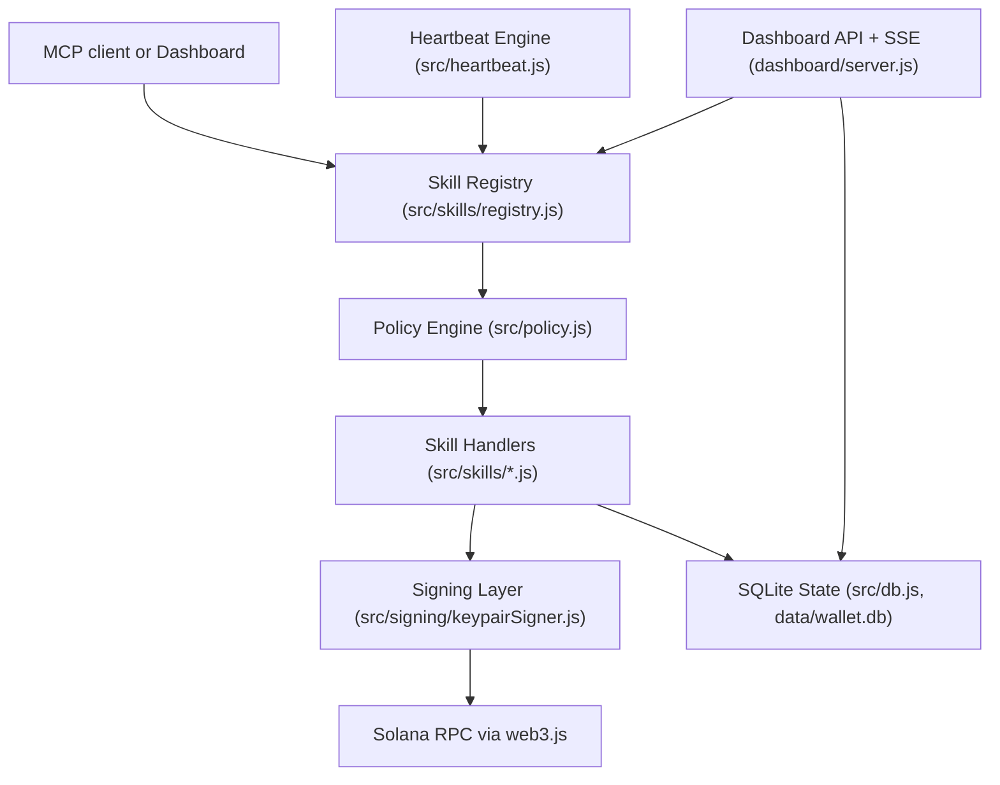
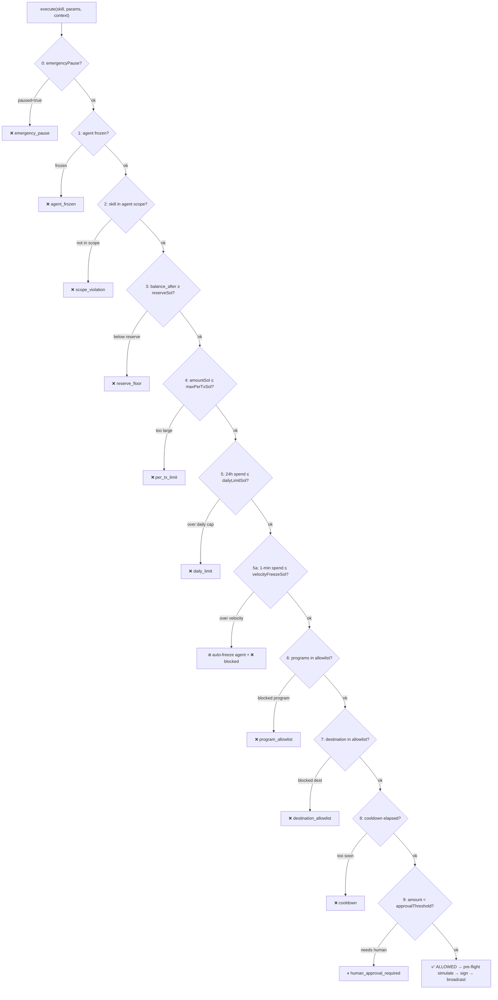

# Deep Dive: Safe Autonomous Finance on Solana

## Thesis
Solana Agent Wallet is designed to solve the safety paradox in agentic wallets: letting agents execute autonomously while preserving strong owner control.

The core claim is practical, not theoretical:
- Autonomous execution is useful only if failure and abuse are containable.
- Containment requires runtime controls, not only key custody.

## Problem Framing
Agentic wallets face three conflicting requirements:
1. Agent autonomy: execute without per-transaction human clicks.
2. Owner control: instantly stop or constrain behavior when needed.
3. Non-custodial operation: private keys remain under owner-controlled signing infrastructure.

The implementation in this repo addresses this with a policy-gated execution pipeline and explicit emergency controls.

## Architecture



## Policy Engine: 11-Check Cascade

Every skill execution passes through this ordered gate. The first failure immediately blocks execution — no subsequent checks run.



All thresholds live in `policy.json` and are **hot-reloadable** via `POST /api/policy` — no restart needed.

## Component Responsibilities
- `src/skills/registry.js`
  - Single execution gateway.
  - Validates schema (Zod), applies policy, dispatches handlers.
- `src/policy.js`
  - Ordered safety checks: pause, freeze, scope, reserve, limits, allowlists, cooldown, human gate.
  - Velocity-based auto-freeze support (`velocityFreezeSol`).
- `src/heartbeat.js`
  - Runs 9 named agents on role-based intervals.
  - Broadcasts runtime events via SSE.
- `dashboard/server.js`
  - Operator control plane: state, rules, policy, pause/resume, freeze/unfreeze.
  - Receipt endpoints for auditability.
- `src/db.js`
  - Durable execution trail for agents, transactions, events, rules, snapshots, alerts, payment requests.

## Key Management & Wallet Encryption

The treasury keypair is stored encrypted at rest using a two-step scheme:

```
scrypt(passphrase, salt, N=16384, r=8, p=1) → 32-byte key
AES-256-GCM(key, iv, plaintext=secretKey) → ciphertext + authTag
```

**Blob format on disk (`wallet.enc.json`):**
```
salt (32 bytes) | iv (12 bytes) | authTag (16 bytes) | ciphertext (32 bytes)
```

**Why these choices:**
- **scrypt** is memory-hard — resists GPU/ASIC brute force attacks on the passphrase.
- **AES-256-GCM** provides authenticated encryption — tampering with the ciphertext is detected before decryption.
- **N=16384** is the maximum scrypt cost that runs without memory errors on typical developer hardware (N=131072 was tested and caused OOM on a 8 GB machine).
- **12-byte IV** is randomly generated on every encryption — never reused.
- The decrypted secret key is held in memory only for the duration of a signing operation and is never written to disk in plaintext.

**Production upgrade path:** Replace `src/signing/keypairSigner.js` with `src/signing/turnkeySigner.js` or `src/signing/privySigner.js`. The signer interface (`{ publicKey, signTransaction, signMessage }`) is identical — the rest of the stack is unchanged.

## Security Controls Implemented

### 1. Emergency Kill Switch
- Global stop via `POST /api/pause`.
- Resume via `POST /api/resume`.
- Policy engine blocks execution while `emergencyPause = true`.

### 2. Pre-Flight Transaction Simulation
Before broadcast, simulation checks are implemented for real fund-moving paths:
- `transfer_sol` (`simulateTransferSol`)
- `transfer_usdc` (`simulateTx` in transfer path)
- `jupiter_swap` (`connection.simulateTransaction` before send)

If simulation fails, execution returns an error and no transaction is sent.

### 3. Spending Velocity Auto-Freeze
- Policy enforces rolling 1-minute spend threshold (`velocityFreezeSol`).
- Breaching threshold auto-freezes offending agent (`frozenAgents`).
- Unfreeze requires explicit operator action.

### 4. Transaction Receipts
- JSON receipt: `GET /api/txs/:txId/receipt`
- Shareable HTML receipt: `GET /api/txs/:txId/receipt.html`
- Receipt data includes status, skill, amount, addresses, reason/error, signature, explorer URL, and timestamps.

## Error Handling & Resilience

### RPC Timeout Wrapper
All Solana RPC calls are wrapped in `withTimeout(promise, ms)`:
```js
// src/wallet.js
async function withTimeout(promise, ms, timeoutError = "rpc_timeout") {
  return Promise.race([
    promise,
    new Promise((_, reject) => setTimeout(() => reject(new Error(timeoutError)), ms)),
  ]);
}
```
Timeouts: `getBalance` → 4.5s, `getParsedTokenAccounts` → 6s. If the RPC node is slow or rate-limited, the call fails fast rather than blocking the agent's heartbeat loop.

### RPC Retry with Backoff
`getBalanceSol` retries up to 3 times with exponential backoff (600ms, 1200ms, 1800ms) before propagating the error:
```js
for (let i = 0; i < retries; i++) {
  try { ... }
  catch (e) {
    if (i === retries - 1) throw e;
    await sleep(600 * (i + 1));
  }
}
```

### Graceful Skill Degradation
Skills that fail (network error, RPC timeout, protocol unavailable) return a structured error object rather than throwing:
```js
{ ok: false, error: "rpc_timeout_get_balance", decision: "error" }
```
The heartbeat engine catches this, records the failed TX in the DB with status `"failed"`, broadcasts it to the dashboard, and continues the next tick. One failing agent does not crash others.

### Pre-flight Simulation Guard
If `simulateTransaction` itself throws (e.g. RPC is unreachable), the simulation failure is treated as a **warning** rather than a hard block — execution proceeds with a `simWarning` flag in the result:
```js
} catch (e) {
  return { ok: true, warning: `simulation_rpc_error: ${e.message}` };
}
```
This prevents a flaky devnet RPC from unnecessarily halting all fund-moving activity.

### Devnet Awareness
Skills that can't execute on devnet (Jupiter swap with no liquidity, live lending positions) return `{ ok: true, note: "devnet: simulated" }` rather than an error. The dashboard displays these as `status: simulated` — green, informative, not alarming.

## Threat Model

### Key Risks
- Prompt-driven unsafe actions.
- Runaway loops draining treasury.
- Repeated failing transactions causing stale-state decisions.
- Unapproved destination/program use.
- High-frequency automated spend spikes.

### Mitigations in Repo
- Scope allowlist gating before execution for all skill calls.
- Spend/limit policy gating for amount-bearing actions.
- Per-action and rolling spend limits.
- Cooldown and human-approval threshold.
- Emergency global pause and per-agent freeze.
- Pre-flight simulation for major send/swap routes.
- Persistent event/tx logging for forensic review.

## How AI Agents Interact With the Wallet

### MCP Path
1. AI client calls an MCP tool in `mcp/server.js`.
2. MCP tool maps to a registered skill.
3. Skill executes through registry policy gate.
4. Result is returned as structured JSON/text.

### Autonomous Path
1. Heartbeat tick triggers role logic (`src/heartbeat.js`).
2. Role invokes skill(s) via registry.
3. Policy decides allow/block.
4. Result is persisted and streamed to dashboard.

## Scalability and Operations
- Multiple agents run independently with separate heartbeat timers.
- SQLite in WAL mode supports concurrent reads from dashboard while agents write.
- Skill registry pattern allows incremental protocol expansion without rewriting execution core.

## Design Tradeoffs
- Some protocol integrations (Marginfi/Marinade intent flows) are currently simulated on devnet for reliability and demo safety.
- This increases demonstration breadth but should be tightened with additional live transaction flows for production hardening.

## Evidence Pointers (Repo)
- Skill gateway: `src/skills/registry.js`
- Safety policy: `src/policy.js`
- Heartbeat runtime: `src/heartbeat.js`
- Dashboard controls: `dashboard/server.js`
- Transactions and receipts: `src/db.js`, `dashboard/server.js`
- Skill implementations: `src/skills/*.js`
