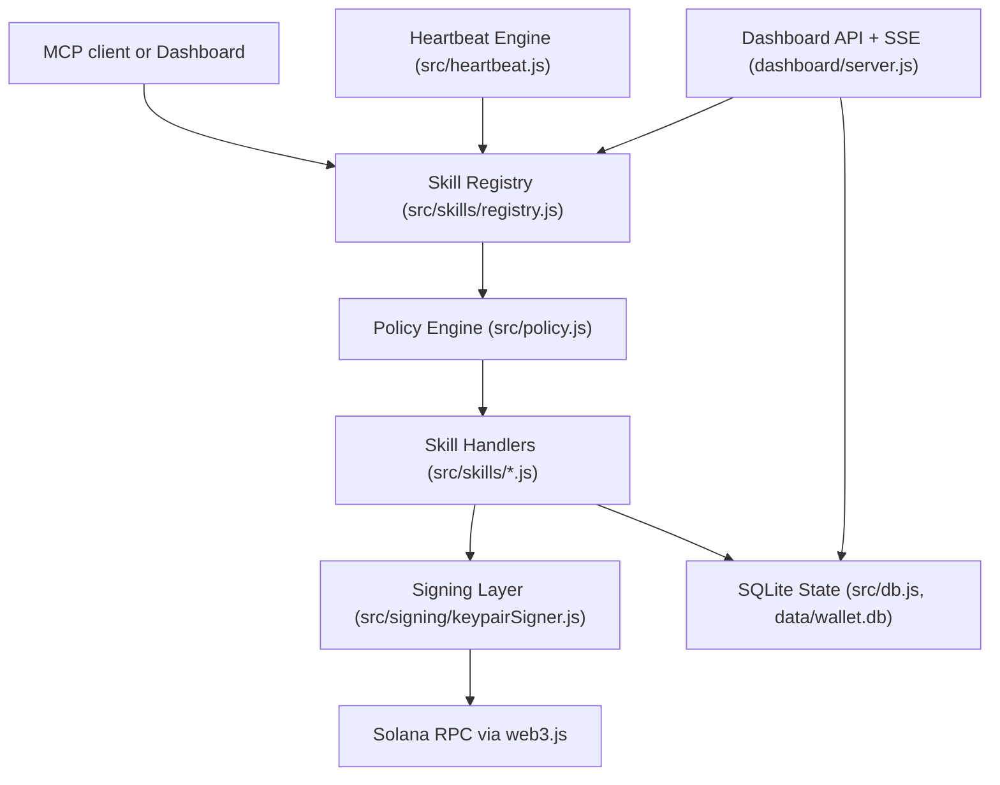
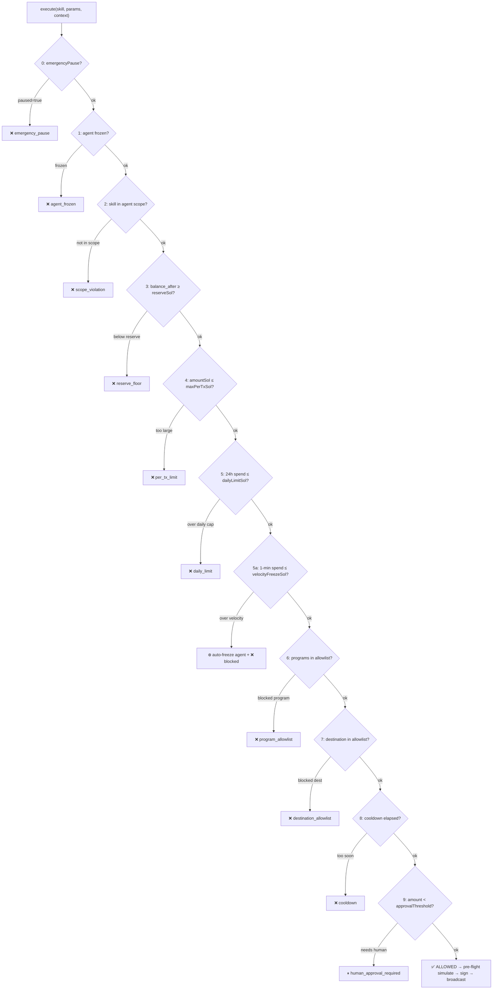

# Deep Dive: Safe Autonomous Finance on Solana

## Thesis
Solana Agent Wallet is designed to solve the safety paradox in agentic wallets: letting agents execute autonomously while preserving strong owner control.

The core claim is practical, not theoretical:
- Autonomous execution is useful only if failure and abuse are containable.
- Containment requires runtime controls, not only key custody.

## Problem Framing
Agentic wallets face three conflicting requirements:
1. Agent autonomy: execute without per-transaction human clicks.
2. Owner control: instantly stop or constrain behavior when needed.
3. Non-custodial operation: private keys remain under owner-controlled signing infrastructure.

The implementation in this repo addresses this with a policy-gated execution pipeline and explicit emergency controls.

## Architecture


```mermaid
flowchart TD
  A["MCP client or Dashboard"] --> B["Skill Registry (src/skills/registry.js)"]
  B --> C["Policy Engine (src/policy.js)"]
  C --> D["Skill Handlers (src/skills/*.js)"]
  D --> E["Signing Layer (src/signing/keypairSigner.js)"]
  E --> F["Solana RPC via web3.js"]
  D --> G["SQLite State (src/db.js, data/wallet.db)"]
  H["Heartbeat Engine (src/heartbeat.js)"] --> B
  I["Dashboard API + SSE (dashboard/server.js)"] --> B
  I --> G
```

## Policy Engine: 11-Check Cascade

Every skill execution passes through this ordered gate. The first failure immediately blocks execution — no subsequent checks run.


```mermaid
flowchart TD
  START["execute(skill, params, context)"] --> C0{"0: emergencyPause?"}
  C0 -- "paused=true" --> B0["❌ emergency_pause"]
  C0 -- "ok" --> C1{"1: agent frozen?"}
  C1 -- "frozen" --> B1["❌ agent_frozen"]
  C1 -- "ok" --> C2{"2: skill in agent scope?"}
  C2 -- "not in scope" --> B2["❌ scope_violation"]
  C2 -- "ok" --> C3{"3: balance_after ≥ reserveSol?"}
  C3 -- "below reserve" --> B3["❌ reserve_floor"]
  C3 -- "ok" --> C4{"4: amountSol ≤ maxPerTxSol?"}
  C4 -- "too large" --> B4["❌ per_tx_limit"]
  C4 -- "ok" --> C5{"5: 24h spend ≤ dailyLimitSol?"}
  C5 -- "over daily cap" --> B5["❌ daily_limit"]
  C5 -- "ok" --> C5A{"5a: 1-min spend ≤ velocityFreezeSol?"}
  C5A -- "over velocity" --> B5A["❄️ auto-freeze agent + ❌ blocked"]
  C5A -- "ok" --> C6{"6: programs in allowlist?"}
  C6 -- "blocked program" --> B6["❌ program_allowlist"]
  C6 -- "ok" --> C7{"7: destination in allowlist?"}
  C7 -- "blocked dest" --> B7["❌ destination_allowlist"]
  C7 -- "ok" --> C8{"8: cooldown elapsed?"}
  C8 -- "too soon" --> B8["❌ cooldown"]
  C8 -- "ok" --> C9{"9: amount < approvalThreshold?"}
  C9 -- "needs human" --> B9["⏸ human_approval_required"]
  C9 -- "ok" --> ALLOW["✅ ALLOWED → pre-flight simulate → sign → broadcast"]
```

All thresholds live in `policy.json` and are **hot-reloadable** via `POST /api/policy` — no restart needed.

## Component Responsibilities
- `src/skills/registry.js`
  - Single execution gateway.
  - Validates schema (Zod), applies policy, dispatches handlers.
- `src/policy.js`
  - Ordered safety checks: pause, freeze, scope, reserve, limits, allowlists, cooldown, human gate.
  - Velocity-based auto-freeze support (`velocityFreezeSol`).
- `src/heartbeat.js`
  - Runs 9 named agents on role-based intervals.
  - Broadcasts runtime events via SSE.
- `dashboard/server.js`
  - Operator control plane: state, rules, policy, pause/resume, freeze/unfreeze.
  - Receipt endpoints for auditability.
- `src/db.js`
  - Durable execution trail for agents, transactions, events, rules, snapshots, alerts, payment requests.

## Key Management & Wallet Encryption

The treasury keypair is stored encrypted at rest using a two-step scheme:

```
scrypt(passphrase, salt, N=16384, r=8, p=1) → 32-byte key
AES-256-GCM(key, iv, plaintext=secretKey) → ciphertext + authTag
```

**Blob format on disk (`wallet.enc.json`):**
```
salt (32 bytes) | iv (12 bytes) | authTag (16 bytes) | ciphertext (32 bytes)
```

**Why these choices:**
- **scrypt** is memory-hard — resists GPU/ASIC brute force attacks on the passphrase.
- **AES-256-GCM** provides authenticated encryption — tampering with the ciphertext is detected before decryption.
- **N=16384** is the maximum scrypt cost that runs without memory errors on typical developer hardware (N=131072 was tested and caused OOM on a 8 GB machine).
- **12-byte IV** is randomly generated on every encryption — never reused.
- The decrypted secret key is held in memory only for the duration of a signing operation and is never written to disk in plaintext.

**Production upgrade path:** Replace `src/signing/keypairSigner.js` with `src/signing/turnkeySigner.js` or `src/signing/privySigner.js`. The signer interface (`{ publicKey, signTransaction, signMessage }`) is identical — the rest of the stack is unchanged.

## Security Controls Implemented

### 1. Emergency Kill Switch
- Global stop via `POST /api/pause`.
- Resume via `POST /api/resume`.
- Policy engine blocks execution while `emergencyPause = true`.

### 2. Pre-Flight Transaction Simulation
Before broadcast, simulation checks are implemented for real fund-moving paths:
- `transfer_sol` (`simulateTransferSol`)
- `transfer_usdc` (`simulateTx` in transfer path)
- `jupiter_swap` (`connection.simulateTransaction` before send)

If simulation fails, execution returns an error and no transaction is sent.

### 3. Spending Velocity Auto-Freeze
- Policy enforces rolling 1-minute spend threshold (`velocityFreezeSol`).
- Breaching threshold auto-freezes offending agent (`frozenAgents`).
- Unfreeze requires explicit operator action.

### 4. Transaction Receipts
- JSON receipt: `GET /api/txs/:txId/receipt`
- Shareable HTML receipt: `GET /api/txs/:txId/receipt.html`
- Receipt data includes status, skill, amount, addresses, reason/error, signature, explorer URL, and timestamps.

## Error Handling & Resilience

### RPC Timeout Wrapper
All Solana RPC calls are wrapped in `withTimeout(promise, ms)`:
```js
// src/wallet.js
async function withTimeout(promise, ms, timeoutError = "rpc_timeout") {
  return Promise.race([
    promise,
    new Promise((_, reject) => setTimeout(() => reject(new Error(timeoutError)), ms)),
  ]);
}
```
Timeouts: `getBalance` → 4.5s, `getParsedTokenAccounts` → 6s. If the RPC node is slow or rate-limited, the call fails fast rather than blocking the agent's heartbeat loop.

### RPC Retry with Backoff
`getBalanceSol` retries up to 3 times with exponential backoff (600ms, 1200ms, 1800ms) before propagating the error:
```js
for (let i = 0; i < retries; i++) {
  try { ... }
  catch (e) {
    if (i === retries - 1) throw e;
    await sleep(600 * (i + 1));
  }
}
```

### Graceful Skill Degradation
Skills that fail (network error, RPC timeout, protocol unavailable) return a structured error object rather than throwing:
```js
{ ok: false, error: "rpc_timeout_get_balance", decision: "error" }
```
The heartbeat engine catches this, records the failed TX in the DB with status `"failed"`, broadcasts it to the dashboard, and continues the next tick. One failing agent does not crash others.

### Pre-flight Simulation Guard
If `simulateTransaction` itself throws (e.g. RPC is unreachable), the simulation failure is treated as a **warning** rather than a hard block — execution proceeds with a `simWarning` flag in the result:
```js
} catch (e) {
  return { ok: true, warning: `simulation_rpc_error: ${e.message}` };
}
```
This prevents a flaky devnet RPC from unnecessarily halting all fund-moving activity.

### Devnet Awareness
Skills that can't execute on devnet (Jupiter swap with no liquidity, live lending positions) return `{ ok: true, note: "devnet: simulated" }` rather than an error. The dashboard displays these as `status: simulated` — green, informative, not alarming.

## Threat Model

### Threat 1: Prompt Injection / Rogue AI Instruction

**Attack:** A malicious payload in a DeFi protocol response or user message tricks the AI agent into calling a skill with harmful parameters (e.g., `transfer_sol` to an attacker address).

**Mitigations:**
- `allowedDestinations[]` in policy.json — only pre-approved addresses can receive funds. Unknown destinations blocked at check #7.
- `allowedPrograms[]` — only approved on-chain programs can be invoked. Check #6.
- Firewall risk scoring (`src/firewall.js`) — new destinations and large amounts increase risk score; high scores block execution with structured reason.
- Human approval gate — amounts above `approvalThresholdSol` require explicit operator sign-off (check #9).
- Session allowlists — if a session restricts `allowedDestinations`, no instruction from within the session can override it.

---

### Threat 2: Runaway Agent Draining Funds

**Attack:** An agent enters a bug loop, executing the same fund-moving action hundreds of times per minute.

**Mitigations:**
- `dailyLimitSol` — 24h rolling cap per agent (check #5). Agent is blocked once daily spend is exhausted.
- `velocityFreezeSol` — 1-minute rolling spend threshold. Breaching it **auto-freezes** the agent (check #5a). Unfreeze requires explicit operator action.
- `cooldownSeconds` — minimum time between successive actions from the same agent (check #8).
- `maxPerTxSol` — single-action ceiling (check #4).
- Idempotency keys — the same key within 24h returns cached result without re-executing (`src/idempotency.js`).

---

### Threat 3: Replay Attack

**Attack:** A recorded valid request is resent to re-execute a fund-moving action (double-spend or repeated swap).

**Mitigations:**
- `IDEMPOTENT_SKILLS` enforcement — all fund-moving skills check a SHA-256 idempotency key (agent+skill scoped) before executing.
- `recordIdempotency` stores the result for 24h; subsequent calls with the same key return the cached result with `idempotencyHit: true`.
- Session TTL — sessions expire and cannot be replayed after their TTL.
- `cooldownSeconds` — consecutive identical actions are rate-limited.

---

### Threat 4: Signer Key Compromise

**Attack:** An attacker obtains the encrypted wallet file and attempts to decrypt or misuse the signing key.

**Mitigations:**
- AES-256-GCM + scrypt (N=16384) key derivation — brute force against the passphrase is memory-hard.
- Per-agent keypairs — compromise of one agent's key does not expose other agents.
- Key rotation — `rotateAgentKey()` generates a new keypair, invalidates the old one, logs the rotation event to the audit DB (`agent_key_versions`), and evicts the signer cache.
- Decrypted key held in memory only during signing — never written to disk or logged.
- Production upgrade: swap `keypairSigner.js` for Turnkey or Privy (HSM-backed, no plaintext key in runtime memory).

---

### Threat 5: RPC Node Tampering / MITM

**Attack:** A compromised or malicious RPC node returns false balance data or silently drops transactions.

**Mitigations:**
- Pre-flight simulation — simulation runs against the same RPC. If the node lies about state, the simulation may pass incorrectly, but the broadcast transaction will still fail on-chain.
- `confirmTransaction` with `"confirmed"` commitment — result is verified via multiple validators.
- `withTimeout` wrappers on all RPC calls — a non-responsive node fails fast rather than blocking agents indefinitely.
- Retry with backoff (`src/retry.js`) — transient RPC failures are retried; hard failures are classified and surfaced.
- Production mitigation: use Helius or QuickNode with staked connection for higher reliability and HTTPS-only endpoints.

---

### Threat 6: Session Scope Escalation

**Attack:** An AI agent issued a limited session (specific skill + max amount) attempts to call a higher-risk skill or exceed its amount cap.

**Mitigations:**
- `validateSessionForExecution()` enforces skill allowlist at execution time — not just at session issuance.
- Amount cap (`maxPerTxSol`) checked per-call, not once at issue.
- Destination allowlist in session — calls to unlisted addresses blocked with `destination_not_allowed`.
- `scopeSubject` mismatch detection — a session issued for `nova` cannot be used by `sable`.
- Session TTL — expired sessions are rejected even if the token is valid.

---

### Threat 7: Race Condition / Double-Spend

**Attack:** Two concurrent requests for the same agent attempt to execute simultaneously, each passing the daily limit check before the other records its spend.

**Mitigations:**
- SQLite WAL mode with sequential writes — daily spend tracked in `agent_spend` DB; concurrent writes are serialized.
- Idempotency key required for all fund-moving skills — same request from two concurrent threads returns cached result on the second call.
- Per-agent spend tracked atomically in policy evaluation.

---

## Custody Model

```
┌─────────────────────────────────────┐
│         Owner / Operator            │
│  (holds WALLET_PASSPHRASE)          │
└────────────────┬────────────────────┘
                 │ decrypts on startup
                 ▼
┌─────────────────────────────────────┐
│     Per-Agent Encrypted Keypairs    │
│  data/agent-wallets/{id}.enc.json   │
│  AES-256-GCM + scrypt passphrase    │
└────────────────┬────────────────────┘
                 │ held in memory (signer cache)
                 ▼
┌─────────────────────────────────────┐
│         Signing Layer               │
│  keypairSigner.js                   │
│  interface: { publicKey,            │
│    signTransaction, signMessage }   │
└────────────────┬────────────────────┘
                 │ swappable → Turnkey / Privy / Lit
                 ▼
┌─────────────────────────────────────┐
│     Solana RPC (devnet / Helius)    │
└─────────────────────────────────────┘
```

**Who controls the keys:**
- The operator who provides `WALLET_PASSPHRASE` at startup.
- No third party has access — no cloud KMS, no shared custody.
- In production: replace `keypairSigner.js` with a hardware-backed signer (Turnkey, Privy server wallets, or Lit Protocol MPC). The swap requires no changes to the policy engine, skill registry, or dashboard.

**Key rotation:**
- `POST /api/agents/:id/rotate-key` — generates new keypair, re-encrypts with same passphrase, deactivates old key, logs to `agent_key_versions`.
- Old public key is recorded in DB for audit; old secret key is immediately evicted from memory and overwritten on disk.

---

## Design Tradeoffs

### SQLite vs PostgreSQL / Redis
**Choice:** SQLite in WAL mode for all state (agents, transactions, sessions, idempotency, key versions).

**Why SQLite:**
- Zero infrastructure — one npm install, no Docker, no cloud service.
- WAL mode supports concurrent reads while agents write.
- For a contest demo with ≤9 agents and ≤1000 TPS of activity, SQLite is sufficient.

**Production tradeoff:** High-volume multi-node deployments would need PostgreSQL (shared transaction log) and Redis (idempotency cache). The query interface (`keyVersionQueries`, `idempotencyQueries`) is abstracted — swapping the backend requires only replacing `src/db.js`.

---

### Devnet Intent Simulation vs Mainnet Real Execution
**Choice:** MarginFi and Marinade skills record intent on devnet rather than executing live.

**Why:**
- MarginFi and Marinade devnet deployments are not actively maintained — liquidity is absent.
- Simulating the intent with live rate data (fetched from mainnet APIs) gives a realistic demo without the brittleness of dead devnet contracts.
- The intent path is explicitly documented in TRUTH_MATRIX.md — no inflation of claims.

**Production upgrade:** Replace intent with `@mrgnlabs/marginfi-client-v2` or `@marinade.finance/marinade-ts-sdk` calls. The policy gate, simulation, and receipt pipeline are unchanged.

---

### In-Memory Signer Cache vs Turnkey / Privy
**Choice:** Decrypted signers cached in-process Map after first use.

**Why:**
- Decrypting from disk on every transaction adds 50–100ms latency and repeated scrypt calls.
- Cache is in-process only — not serialized, not logged, not network-accessible.
- Cache is evicted on key rotation.

**Production tradeoff:** In-memory keys are vulnerable to process memory inspection. Turnkey or Privy server wallets sign in a hardware-backed enclave — the decrypted key never exists in application memory. The `{ publicKey, signTransaction, signMessage }` interface makes this swap transparent to the rest of the stack.

---

### 11-Check vs Simpler Policy
**Choice:** 11 ordered checks with first-failure-wins semantics.

**Why:**
- Ordered checks create a clear mental model: safety checks (pause/freeze/scope) run before spend checks (reserve/limits), before allowlist checks, before cooldown/approval.
- First-failure-wins prevents bypassing a critical check by exploiting a later one.
- All values are hot-reloadable — no restart needed to tighten policy.

**Tradeoff:** More checks = more code to test. Mitigated by the 109-test suite covering every check independently.

## How AI Agents Interact With the Wallet

### MCP Path
1. AI client calls an MCP tool in `mcp/server.js`.
2. MCP tool maps to a registered skill.
3. Skill executes through registry policy gate.
4. Result is returned as structured JSON/text.

### Autonomous Path
1. Heartbeat tick triggers role logic (`src/heartbeat.js`).
2. Role invokes skill(s) via registry.
3. Policy decides allow/block.
4. Result is persisted and streamed to dashboard.

## Scalability and Operations
- Multiple agents run independently with separate heartbeat timers.
- SQLite in WAL mode supports concurrent reads from dashboard while agents write.
- Skill registry pattern allows incremental protocol expansion without rewriting execution core.

## Design Tradeoffs
- Some protocol integrations (Marginfi/Marinade intent flows) are currently simulated on devnet for reliability and demo safety.
- This increases demonstration breadth but should be tightened with additional live transaction flows for production hardening.

## Evidence Pointers (Repo)
- Skill gateway: `src/skills/registry.js`
- Safety policy: `src/policy.js`
- Heartbeat runtime: `src/heartbeat.js`
- Dashboard controls: `dashboard/server.js`
- Transactions and receipts: `src/db.js`, `dashboard/server.js`
- Skill implementations: `src/skills/*.js`
